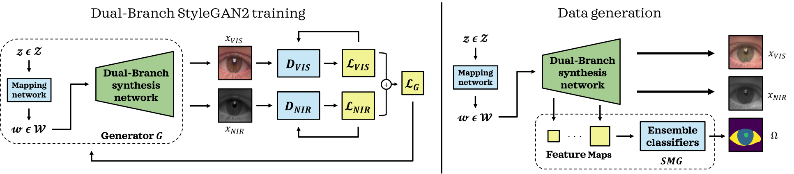

# BiOcularGAN: Bimodal Synthesis and Annotation of Ocular Images 




**BiOcularGAN: Bimodal Synthesis and Annotation of Ocular Images**<br>
Darian Tomašević, Peter Peer, Vitomir Štruc<br>
https://arxiv.org/abs/2205.01536<br>

Abstract : *Current state-of-the-art segmentation techniques for ocular images are critically dependent on large-scale annotated datasets, which are labor-intensive to gather and often raise privacy concerns. In this paper, we present a novel framework, called BiOcularGAN, capable of generating synthetic large-scale datasets of photorealistic (visible light and near infrared) ocular images, together with corresponding segmentation labels to address these issues. At its core, the framework relies on a novel Dual-Branch StyleGAN2 (DB-StyleGAN2) model that facilitates bimodal image generation, and a Semantic Mask Generator (SMG) that produces semantic annotations by exploiting DB-StyleGAN2's feature space. We evaluate BiOcularGAN through extensive experiments across five diverse ocular datasets and analyze the effects of bimodal data generation on image quality and the produced annotations. Our experimental results show that BiOcularGAN is able to produce high-quality matching bimodal images and annotations (with minimal manual intervention) that can be used to train highly competitive (deep) segmentation models that perform well across multiple real-world datasets.*

# Release Notes: 

The BiOcularGAN PyTorch framework allows for generation of matching bimodal data along with corresponding annotations. The framework is made up of a Dual-Branch StyleGAN2, based on the [StyleGAN2-ADA](https://github.com/NVlabs/stylegan2-ada-pytorch) implementation, and a Style Interpreter, based on the [DatasetGAN](https://github.com/nv-tlabs/datasetGAN_release) implementation updated for use with StyleGAN2.

This repository follows the [Nvidia Source Code License](https://nvlabs.github.io/stylegan2-ada-pytorch/license.html).

# Requirements and Setup:

* Linux and Windows are supported, but we recommend Linux for performance and compatibility reasons.
* 1&ndash;8 high-end NVIDIA GPUs with at least 12 GB of memory. We have tested our implementation on a NVIDIA RTX 3060 GPU and a NVIDIA RTX 3090 GPU. Parallelization across multiple GPUs are also supported for training the DB-StyleGAN2 network.
* We highly recommend using Docker, if possible, to setup the environment. Please use the [provided Dockerfile](./Dockerfile) to build an image with the required library dependencies. (The Docker image requires NVIDIA driver release `r455.23` or later.)
* Otherwise the requirements remain the same as in  [StyleGAN2-ADA](https://github.com/NVlabs/stylegan2-ada-pytorch). These being 64-bit Python 3.7, PyTorch 1.7.1, and CUDA toolkit 11.0 or later. Use at least version 11.1 if running on RTX 3090. Check the linked repository if you are having any problems.


How to build Docker environment: 
```.bash
docker build --tag sg2ada:latest .
```

# How to Run (using Docker): 
To run the BiOcularGAN framework use the `main_BiOcularGAN.ipynb` Jupyter Notebook, or follow the below steps:

## Step 1. Train the Dual-Branch StyleGAN2 network: 
```.bash
./docker_run.sh python train_DB_StyleGAN2.py --cfg="auto" --snap=20  --data="DATASETS/CrossEyed_256/train/images" --resume="ffhq256" --gpus=1 --mirror=1 --outdir="IJCB_EXPERIMENTS/DB_SG2/experiments_CrossEyed_NIR_RGB_256_NEW_MAY"
```

Here the `--data` argument should point to a directory of `RGB` images, structured similarly to the example in the `IJCB_EXPERIMENTS` directory. It should have a neighbour directory filled with corresponding `NIR` (grayscale) images.

For details on other arguments and the configurations check the [StyleGAN2-ADA](https://github.com/NVlabs/stylegan2-ada-pytorch) documentation.

## Step 1.5 Prepare for Style Interpreter steps:
Make the required directories ... 
TODO save under checkpoints

## Step 2. Generate examples of training image pairs: <br>
```.bash
docker_run.sh python make_training_data_DB_SG2.py --exp="IJCB_EXPERIMENTS/interpreter/CrossEyed_NIR_RGB/generate.json" --sv_path="IJCB_EXPERIMENTS/interpreter/CrossEyed_NIR_RGB
``` 
## Step 2.1. Annotate:
Annotate the desired number of images (8 in our experiments) with the desired number of regions (4 and 10 in our experiments). For this you can use [GIMP](https://www.gimp.org/) or any other software.

## Step 2.2. Preprocess annotations:
Preprocess the annotations so that the classes in the range `{0, 1, 2, ... num_classes}` and are saved as `.npy` files. For this, you can also use the `preprocess_annotated_images_and_latents.ipynb` Jupyter Notebook, however, make sure that the values correspond to your annotations.

## Step 3. Train the Style Interpreter:
```.bash
docker_run.sh python train_interpreter_DB_SG2.py --exp "IJCB_EXPERIMENTS/interpreter/CrossEyed_NIR_RGB/train_datagan.json"
```

## Step 4. Generate dataset of matching RGB and NIR images with corresponding annotations:
```.bash
docker_run.sh python train_interpreter_DB_SG2.py --generate_data True --num_sample=500 --exp "IJCB_EXPERIMENTS/interpreter/CrossEyed_NIR_RGB/train_datagan.json"  --resume "IJCB_EXPERIMENTS/interpreter/CrossEyed_NIR_RGB" 
```


## Notes:
Pre-trained networks are stored as `*.pkl` files. These contain the Generator `'G'` and Discriminator `'D'`, as well as `'G_ema'`, represents a moving average of the generator weights over several training steps. The generator consists of two submodules, `G.mapping` and `G.synthesis`, that can be executed separately. They also support various additional options, such as truncation. For further examples, check [StyleGAN2-ADA](https://github.com/NVlabs/stylegan2-ada-pytorch).


## Preparing datasets:

TODO 
Datasets are stored as uncompressed ZIP archives containing uncompressed PNG files and a metadata file `dataset.json` for labels.


In this example, the results are saved to a newly created directory `~/training-runs/<ID>-mydataset-auto1`, controlled by `--outdir`. The training exports network pickles (`network-snapshot-<INT>.pkl`) and example images (`fakes<INT>.png`) at regular intervals (controlled by `--snap`). For each pickle, it also evaluates FID (controlled by `--metrics`) and logs the resulting scores in `metric-fid50k_full.jsonl` (as well as TFEvents if TensorBoard is installed).

The name of the output directory reflects the training configuration. For example, `00000-mydataset-auto1` indicates that the *base configuration* was `auto1`, meaning that the hyperparameters were selected automatically for training on one GPU. The base configuration is controlled by `--cfg`:


## License

Copyright &copy; 2021, NVIDIA Corporation. All rights reserved.

This work is made available under the [Nvidia Source Code License](https://nvlabs.github.io/stylegan2-ada-pytorch/license.html).

## Citation

Currently under review in IJCB 2022.

