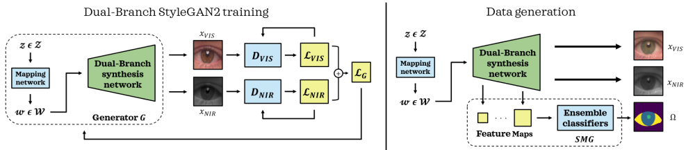

# BiOcularGAN: Bimodal Synthesis and Annotation of Ocular Images 




## 
**BiOcularGAN: Bimodal Synthesis and Annotation of Ocular Images**<br>
Darian Tomašević, Peter Peer, Vitomir Štruc<br>
https://arxiv.org/abs/2205.01536<br>

Abstract : *Current state-of-the-art segmentation techniques for ocular images are critically dependent on large-scale annotated datasets, which are labor-intensive to gather and often raise privacy concerns. In this paper, we present a novel framework, called BiOcularGAN, capable of generating synthetic large-scale datasets of photorealistic (visible light and near infrared) ocular images, together with corresponding segmentation labels to address these issues. At its core, the framework relies on a novel Dual-Branch StyleGAN2 (DB-StyleGAN2) model that facilitates bimodal image generation, and a Semantic Mask Generator (SMG) that produces semantic annotations by exploiting DB-StyleGAN2's feature space. We evaluate BiOcularGAN through extensive experiments across five diverse ocular datasets and analyze the effects of bimodal data generation on image quality and the produced annotations. Our experimental results show that BiOcularGAN is able to produce high-quality matching bimodal images and annotations (with minimal manual intervention) that can be used to train highly competitive (deep) segmentation models that perform well across multiple real-world datasets.*


## TODO preprocess procedure ... for which you can use GIMP and the preprocess_latents_and_files.ipynb


Based on implementation ... 


## TODO preprocess procedure ... for which you can use GIMP and the preprocess_latents_and_files.ipynb

## StyleGAN2-ADA &mdash; Official PyTorch implementation

**Training Generative Adversarial Networks with Limited Data**<br>
Tero Karras, Miika Aittala, Janne Hellsten, Samuli Laine, Jaakko Lehtinen, Timo Aila<br>
https://arxiv.org/abs/2006.06676<br>

Abstract: *Training generative adversarial networks (GAN) using too little data typically leads to discriminator overfitting, causing training to diverge. We propose an adaptive discriminator augmentation mechanism that significantly stabilizes training in limited data regimes. The approach does not require changes to loss functions or network architectures, and is applicable both when training from scratch and when fine-tuning an existing GAN on another dataset. We demonstrate, on several datasets, that good results are now possible using only a few thousand training images, often matching StyleGAN2 results with an order of magnitude fewer images. We expect this to open up new application domains for GANs. We also find that the widely used CIFAR-10 is, in fact, a limited data benchmark, and improve the record FID from 5.59 to 2.42.*

For business inquiries, please contact [researchinquiries@nvidia.com](mailto:researchinquiries@nvidia.com)<br>
For press and other inquiries, please contact Hector Marinez at [hmarinez@nvidia.com](mailto:hmarinez@nvidia.com)<br>

## Release notes

This repository is a faithful reimplementation of [StyleGAN2-ADA](https://github.com/NVlabs/stylegan2-ada/) in PyTorch, focusing on correctness, performance, and compatibility.

**Correctness**
* Full support for all primary training configurations.
* Extensive verification of image quality, training curves, and quality metrics against the TensorFlow version.
* Results are expected to match in all cases, excluding the effects of pseudo-random numbers and floating-point arithmetic.

**Performance**
* Training is typically 5%&ndash;30% faster compared to the TensorFlow version on NVIDIA Tesla V100 GPUs.
* Inference is up to 35% faster in high resolutions, but it may be slightly slower in low resolutions.
* GPU memory usage is comparable to the TensorFlow version.
* Faster startup time when training new networks (<50s), and also when using pre-trained networks (<4s).
* New command line options for tweaking the training performance.

**Compatibility**
* Compatible with old network pickles created using the TensorFlow version.
* New ZIP/PNG based dataset format for maximal interoperability with existing 3rd party tools.
* TFRecords datasets are no longer supported &mdash; they need to be converted to the new format.
* New JSON-based format for logs, metrics, and training curves.
* Training curves are also exported in the old TFEvents format if TensorBoard is installed.
* Command line syntax is mostly unchanged, with a few exceptions (e.g., `dataset_tool.py`).
* Comparison methods are not supported (`--cmethod`, `--dcap`, `--cfg=cifarbaseline`, `--aug=adarv`)
* **Truncation is now disabled by default.**

## Requirements

* Linux and Windows are supported, but we recommend Linux for performance and compatibility reasons.
* 1&ndash;8 high-end NVIDIA GPUs with at least 12 GB of memory. We have done all testing and development using NVIDIA DGX-1 with 8 Tesla V100 GPUs.
* 64-bit Python 3.7 and PyTorch 1.7.1. See [https://pytorch.org/](https://pytorch.org/) for PyTorch install instructions.
* CUDA toolkit 11.0 or later.  Use at least version 11.1 if running on RTX 3090.  (Why is a separate CUDA toolkit installation required?  See comments in [#2](https://github.com/NVlabs/stylegan2-ada-pytorch/issues/2#issuecomment-779457121).)
* Python libraries: `pip install click requests tqdm pyspng ninja imageio-ffmpeg==0.4.3`.  We use the Anaconda3 2020.11 distribution which installs most of these by default.
* Docker users: use the [provided Dockerfile](./Dockerfile) to build an image with the required library dependencies.

The code relies heavily on custom PyTorch extensions that are compiled on the fly using NVCC. On Windows, the compilation requires Microsoft Visual Studio. We recommend installing [Visual Studio Community Edition](https://visualstudio.microsoft.com/vs/) and adding it into `PATH` using `"C:\Program Files (x86)\Microsoft Visual Studio\<VERSION>\Community\VC\Auxiliary\Build\vcvars64.bat"`.

## Environment Setup

Pre-trained networks are stored as `*.pkl` files that can be referenced using local filenames or URLs:

```.bash
# Generate curated MetFaces images without truncation (Fig.10 left)
python generate.py --outdir=out --trunc=1 --seeds=85,265,297,849 \
    --network=https://nvlabs-fi-cdn.nvidia.com/stylegan2-ada-pytorch/pretrained/metfaces.pkl

# Generate uncurated MetFaces images with truncation (Fig.12 upper left)
python generate.py --outdir=out --trunc=0.7 --seeds=600-605 \
    --network=https://nvlabs-fi-cdn.nvidia.com/stylegan2-ada-pytorch/pretrained/metfaces.pkl

# Generate class conditional CIFAR-10 images (Fig.17 left, Car)
python generate.py --outdir=out --seeds=0-35 --class=1 \
    --network=https://nvlabs-fi-cdn.nvidia.com/stylegan2-ada-pytorch/pretrained/cifar10.pkl

# Style mixing example
python style_mixing.py --outdir=out --rows=85,100,75,458,1500 --cols=55,821,1789,293 \
    --network=https://nvlabs-fi-cdn.nvidia.com/stylegan2-ada-pytorch/pretrained/metfaces.pkl
```

Outputs from the above commands are placed under `out/*.png`, controlled by `--outdir`. Downloaded network pickles are cached under `$HOME/.cache/dnnlib`, which can be overridden by setting the `DNNLIB_CACHE_DIR` environment variable. The default PyTorch extension build directory is `$HOME/.cache/torch_extensions`, which can be overridden by setting `TORCH_EXTENSIONS_DIR`.

**Docker**: You can run the above curated image example using Docker as follows:

```.bash
docker build --tag sg2ada:latest .
./docker_run.sh python3 generate.py --outdir=out --trunc=1 --seeds=85,265,297,849 \
    --network=https://nvlabs-fi-cdn.nvidia.com/stylegan2-ada-pytorch/pretrained/metfaces.pkl
```

Note: The Docker image requires NVIDIA driver release `r455.23` or later.


## Using networks from Python

You can use pre-trained networks in your own Python code as follows:

```.python
with open('ffhq.pkl', 'rb') as f:
    G = pickle.load(f)['G_ema'].cuda()  # torch.nn.Module
z = torch.randn([1, G.z_dim]).cuda()    # latent codes
c = None                                # class labels (not used in this example)
img = G(z, c)                           # NCHW, float32, dynamic range [-1, +1]
```

The above code requires `torch_utils` and `dnnlib` to be accessible via `PYTHONPATH`. It does not need source code for the networks themselves &mdash; their class definitions are loaded from the pickle via `torch_utils.persistence`.

The pickle contains three networks. `'G'` and `'D'` are instantaneous snapshots taken during training, and `'G_ema'` represents a moving average of the generator weights over several training steps. The networks are regular instances of `torch.nn.Module`, with all of their parameters and buffers placed on the CPU at import and gradient computation disabled by default.

The generator consists of two submodules, `G.mapping` and `G.synthesis`, that can be executed separately. They also support various additional options:

```.python
w = G.mapping(z, c, truncation_psi=0.5, truncation_cutoff=8)
img = G.synthesis(w, noise_mode='const', force_fp32=True)
```

Please refer to [`generate.py`](./generate.py), [`style_mixing.py`](./style_mixing.py), and [`projector.py`](./projector.py) for further examples.

## Preparing datasets

Datasets are stored as uncompressed ZIP archives containing uncompressed PNG files and a metadata file `dataset.json` for labels.

Custom datasets can be created from a folder containing images; see [`python dataset_tool.py --help`](./docs/dataset-tool-help.txt) for more information. Alternatively, the folder can also be used directly as a dataset, without running it through `dataset_tool.py` first, but doing so may lead to suboptimal performance.

Legacy TFRecords datasets are not supported &mdash; see below for instructions on how to convert them.

**FFHQ**:

Step 1: Download the [Flickr-Faces-HQ dataset](https://github.com/NVlabs/ffhq-dataset) as TFRecords.

Step 2: Extract images from TFRecords using `dataset_tool.py` from the [TensorFlow version of StyleGAN2-ADA](https://github.com/NVlabs/stylegan2-ada/):

```.bash
# Using dataset_tool.py from TensorFlow version at
# https://github.com/NVlabs/stylegan2-ada/
python ../stylegan2-ada/dataset_tool.py unpack \
    --tfrecord_dir=~/ffhq-dataset/tfrecords/ffhq --output_dir=/tmp/ffhq-unpacked
```

Step 3: Create ZIP archive using `dataset_tool.py` from this repository:

```.bash
# Original 1024x1024 resolution.
python dataset_tool.py --source=/tmp/ffhq-unpacked --dest=~/datasets/ffhq.zip

# Scaled down 256x256 resolution.
python dataset_tool.py --source=/tmp/ffhq-unpacked --dest=~/datasets/ffhq256x256.zip \
    --width=256 --height=256
```

## Training new networks

In its most basic form, training new networks boils down to:

```.bash
python train.py --outdir=~/training-runs --data=~/mydataset.zip --gpus=1 --dry-run
python train.py --outdir=~/training-runs --data=~/mydataset.zip --gpus=1
```

The first command is optional; it validates the arguments, prints out the training configuration, and exits. The second command kicks off the actual training.

In this example, the results are saved to a newly created directory `~/training-runs/<ID>-mydataset-auto1`, controlled by `--outdir`. The training exports network pickles (`network-snapshot-<INT>.pkl`) and example images (`fakes<INT>.png`) at regular intervals (controlled by `--snap`). For each pickle, it also evaluates FID (controlled by `--metrics`) and logs the resulting scores in `metric-fid50k_full.jsonl` (as well as TFEvents if TensorBoard is installed).

The name of the output directory reflects the training configuration. For example, `00000-mydataset-auto1` indicates that the *base configuration* was `auto1`, meaning that the hyperparameters were selected automatically for training on one GPU. The base configuration is controlled by `--cfg`:

| Base config           | Description
| :-------------------- | :----------
| `auto`&nbsp;(default) | Automatically select reasonable defaults based on resolution and GPU count. Serves as a good starting point for new datasets but does not necessarily lead to optimal results.
| `stylegan2`           | Reproduce results for StyleGAN2 config F at 1024x1024 using 1, 2, 4, or 8 GPUs.
| `paper256`            | Reproduce results for FFHQ and LSUN Cat at 256x256 using 1, 2, 4, or 8 GPUs.
| `paper512`            | Reproduce results for BreCaHAD and AFHQ at 512x512 using 1, 2, 4, or 8 GPUs.
| `paper1024`           | Reproduce results for MetFaces at 1024x1024 using 1, 2, 4, or 8 GPUs.
| `cifar`               | Reproduce results for CIFAR-10 (tuned configuration) using 1 or 2 GPUs.

The training configuration can be further customized with additional command line options:

* `--aug=noaug` disables ADA.
* `--cond=1` enables class-conditional training (requires a dataset with labels).
* `--mirror=1` amplifies the dataset with x-flips. Often beneficial, even with ADA.
* `--resume=ffhq1024 --snap=10` performs transfer learning from FFHQ trained at 1024x1024.
* `--resume=~/training-runs/<NAME>/network-snapshot-<INT>.pkl` resumes a previous training run.
* `--gamma=10` overrides R1 gamma. We recommend trying a couple of different values for each new dataset.
* `--aug=ada --target=0.7` adjusts ADA target value (default: 0.6).
* `--augpipe=blit` enables pixel blitting but disables all other augmentations.
* `--augpipe=bgcfnc` enables all available augmentations (blit, geom, color, filter, noise, cutout).

Please refer to [`python train.py --help`](./docs/train-help.txt) for the full list.


## License

Copyright &copy; 2021, NVIDIA Corporation. All rights reserved.

This work is made available under the [Nvidia Source Code License](https://nvlabs.github.io/stylegan2-ada-pytorch/license.html).

## Citation

TODO 

```
@inproceedings{Karras2020ada,
  title     = {Training Generative Adversarial Networks with Limited Data},
  author    = {Tero Karras and Miika Aittala and Janne Hellsten and Samuli Laine and Jaakko Lehtinen and Timo Aila},
  booktitle = {Proc. NeurIPS},
  year      = {2020}
}
```

